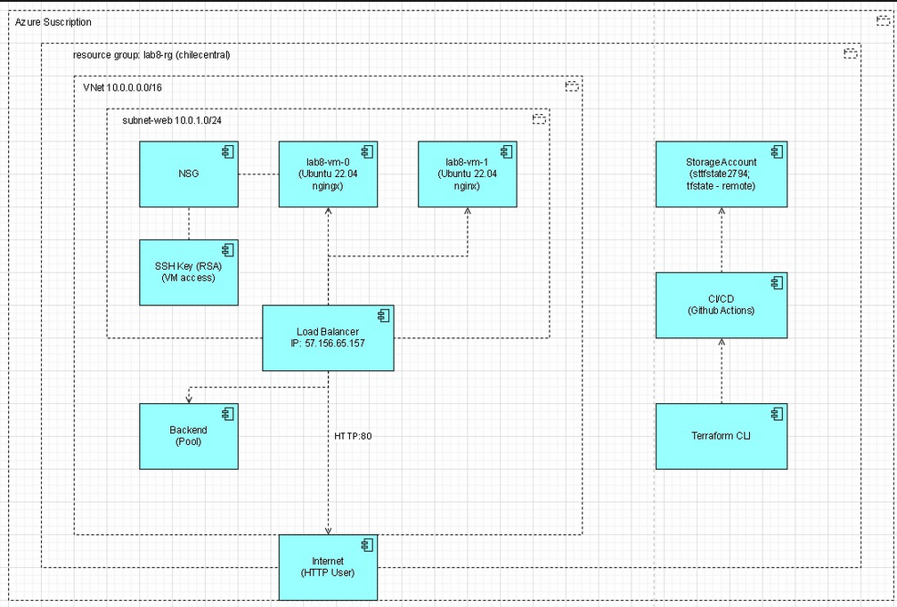
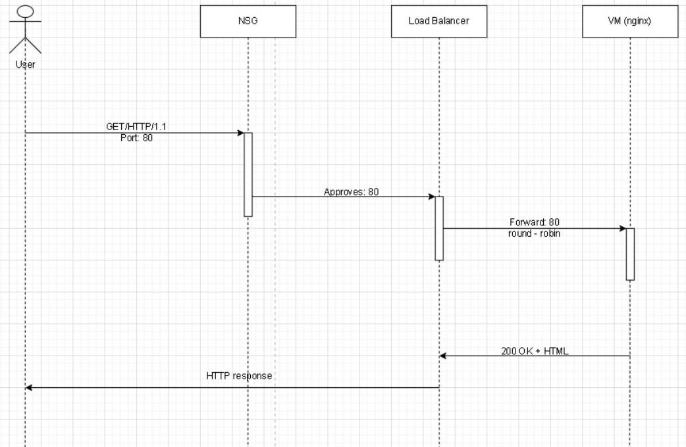
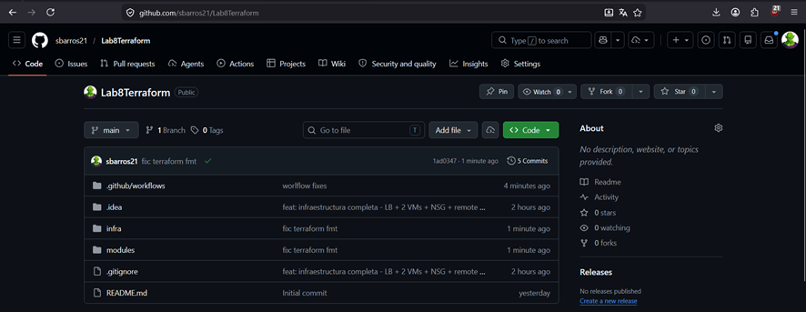
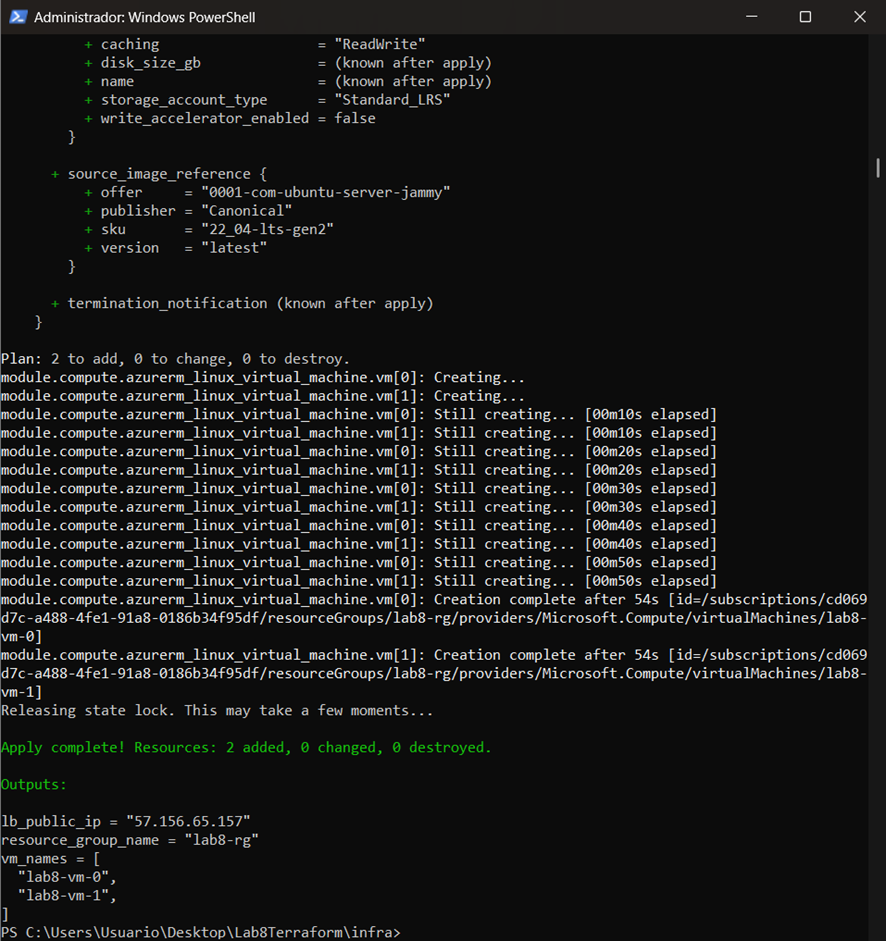
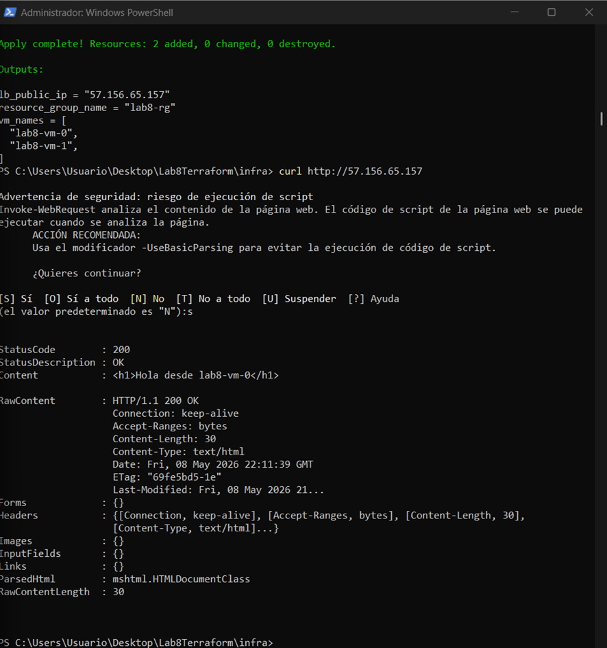

# Lab #8 Terraform

Sebastián Barros

Lina Sanchez

Julián Ramirez

---

## Descripción

Despliegue de infraestructura de alta disponibilidad en Azure usando Terraform como herramienta de IaC (Infrastructure as Code). La arquitectura incluye un Load Balancer público, 2 VMs Linux con nginx, red virtual con NSG y backend remoto para el estado de Terraform en Azure Storage.

---

## Arquitectura

Diagrama de Componentes



Los componentes principales son:

- **Resource Group:** `lab8-rg` en `chilecentral`
- **VNet:** `10.0.0.0/16` con subred `subnet-web 10.0.1.0/24`
- **NSG:** permite HTTP `:80` desde Internet y SSH `:22` solo desde la IP del desarrollador
- **Load Balancer:** IP pública `57.156.65.157`, health probe TCP/80, regla 80→80
- **2 VMs Ubuntu 22.04:** `lab8-vm-0` y `lab8-vm-1`, con nginx instalado via cloud-init
- **Storage Account:** `sttfstate2794` en `southcentralus` para el remote state

---

## Estructura del repositorio

.
├── infra/
│   ├── main.tf
│   ├── providers.tf
│   ├── variables.tf
│   ├── outputs.tf
│   ├── backend.hcl.example
│   ├── cloud-init.yaml
│   └── env/
│       └── dev.tfvars
├── modules/
│   ├── vnet/
│   │   ├── main.tf
│   │   ├── variables.tf
│   │   └── outputs.tf
│   ├── compute/
│   │   ├── main.tf
│   │   ├── variables.tf
│   │   └── outputs.tf
│   └── lb/
│       ├── main.tf
│       ├── variables.tf
│       └── outputs.tf
└── .github/
└── workflows/
└── terraform.yml


---

## Requisitos previos

- Azure CLI instalado y autenticado (`az login`)
- Terraform >= 1.6
- Cuenta Azure for Students activa
- SSH key generada (RSA 4096)

---

## Uso

### 1. Clonar el repositorio

```bash
git clone https://github.com/sbarros21/Lab8Terraform.git
cd Lab8Terraform
```

### 2. Configurar el backend

```bash
cp infra/backend.hcl.example infra/backend.hcl
# Editar backend.hcl con los datos de tu Storage Account
```

### 3. Inicializar Terraform

```bash
cd infra
terraform init -backend-config=backend.hcl
```

### 4. Desplegar

```bash
terraform plan -var-file=env/dev.tfvars -out plan.tfplan
terraform apply "plan.tfplan"
```

### 5. Validar el Load Balancer

```bash
curl http://<lb_public_ip>
# Respuesta esperada: <h1>Hola desde lab8-vm-0</h1>
```

### 6. Destruir al finalizar

```bash
terraform destroy -var-file=env/dev.tfvars
```

---

## Diagrama de secuencia

Diagrama de Secuencia



---

## CI/CD con GitHub Actions

El workflow `.github/workflows/terraform.yml` ejecuta automáticamente `fmt`, `validate` y `plan` en cada push a `main`. El job de `apply` es manual via `workflow_dispatch`.

La autenticación con Azure se realiza mediante OIDC (federación de identidad), sin credenciales de larga vida almacenadas como secrets.

Workflow exitoso



---

## Evidencia del despliegue

Terraform apply exitoso



Curl evidenciando respuesta de VM



---


## Reflexión técnica

**¿Por qué L4 LB vs Application Gateway (L7)?**
Se eligió Load Balancer L4 porque el caso de uso es simple: distribuir tráfico HTTP entre VMs idénticas. Un Application Gateway L7 añadiría routing por path, terminación TLS y WAF, pero triplicaría el costo y la complejidad innecesariamente para este laboratorio.

**¿Qué implicaciones de seguridad tiene exponer 22/TCP?**
Exponer SSH a Internet es un vector de ataque frecuente. Se mitigó restringiendo el NSG para que solo la IP del desarrollador pueda conectarse al puerto 22. En producción la solución correcta sería usar Azure Bastion y eliminar esa regla completamente.

**¿Qué mejoras harías si esto fuera producción?**
Creo añadiría autoscaling con VM Scale Sets,  migraría a Application Gateway con WAF y TLS, implementaría Azure Monitor con alertas, usaría Azure Bastion para eliminar el SSH público, y se separarían los entornos con pipelines que requieran aprobación manual antes de aplicar cambios.